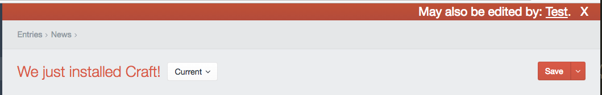
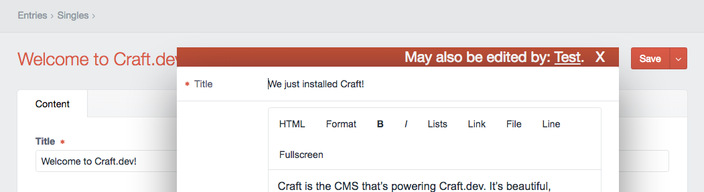

# MN Snitch plugin for Craft CMS

MN Snitch watches entry, category, and global set editors, and lets you know when someone else may also be editing the same thing at the same time.

## Installation

To install MN Snitch, follow these steps:

1. Download & unzip the file and place the `mnsnitch` directory into your `craft/plugins` directory
2. Install plugin in the Craft Control Panel under Settings > Plugins

## What You See

A warning banner appears at the top of the editor pane when someone else may be editing the same element:

A warning banner also appears at the top of editor modals:

Clicking the `X` will dismiss the banner

## Configuration

The default configuration can be overridden with a config file in `craft/config/mnsnitch.php`. This is a standard Craft config file, with the usual multienvironment support. The configurable values are:

- `serverPollInterval`: interval (in seconds) for polling server to look for newly arrived conflicts. Default value: `15`
- `message`: text for the warning banner. The text `{user}` will be replace with a mailto link to the conflicting user. Default value: `May also be edited by: {user}.`

## MN Snitch Changelog

### 1.0.0 -- 2016.09.06

* Initial release

Brought to you by [Marion Newlevant](http://marion.newlevant.com)
